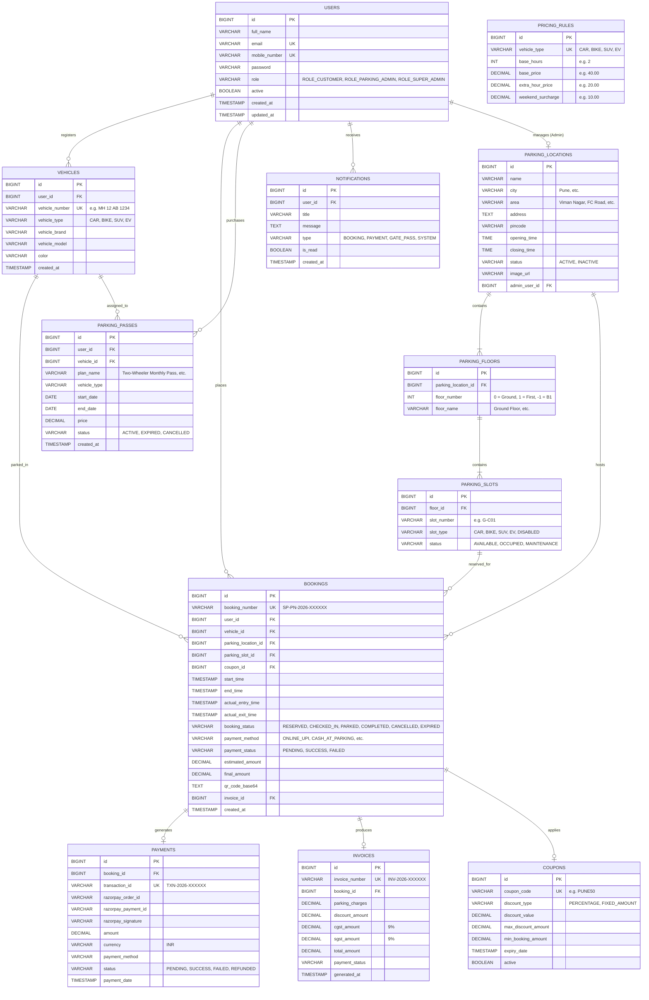

# SmartPark Entity-Relationship (ER) Diagram 🇮🇳

This document details the database schema and relationship models implemented in **MySQL 8.0** for the SmartPark application.

```mermaid
erDiagram
    USERS ||--o{ VEHICLES : "registers"
    USERS ||--o{ BOOKINGS : "places"
    USERS ||--o{ PARKING_PASSES : "purchases"
    USERS ||--o{ NOTIFICATIONS : "receives"
    USERS ||--o| PARKING_LOCATIONS : "manages (Admin)"

    PARKING_LOCATIONS ||--|{ PARKING_FLOORS : "contains"
    PARKING_FLOORS ||--|{ PARKING_SLOTS : "contains"
    PARKING_LOCATIONS ||--o{ BOOKINGS : "hosts"

    VEHICLES ||--o{ BOOKINGS : "parked_in"
    VEHICLES ||--o{ PARKING_PASSES : "assigned_to"

    PARKING_SLOTS ||--o{ BOOKINGS : "reserved_for"

    BOOKINGS ||--o| PAYMENTS : "generates"
    BOOKINGS ||--o| INVOICES : "produces"
    BOOKINGS ||--o| COUPONS : "applies"

    USERS {
        BIGINT id PK
        VARCHAR full_name
        VARCHAR email UK
        VARCHAR mobile_number UK
        VARCHAR password
        VARCHAR role "ROLE_CUSTOMER, ROLE_PARKING_ADMIN, ROLE_SUPER_ADMIN"
        BOOLEAN active
        TIMESTAMP created_at
        TIMESTAMP updated_at
    }

    VEHICLES {
        BIGINT id PK
        BIGINT user_id FK
        VARCHAR vehicle_number UK "e.g. MH 12 AB 1234"
        VARCHAR vehicle_type "CAR, BIKE, SUV, EV"
        VARCHAR vehicle_brand
        VARCHAR vehicle_model
        VARCHAR color
        TIMESTAMP created_at
    }

    PARKING_LOCATIONS {
        BIGINT id PK
        VARCHAR name
        VARCHAR city "Pune, etc."
        VARCHAR area "Viman Nagar, FC Road, etc."
        TEXT address
        VARCHAR pincode
        TIME opening_time
        TIME closing_time
        VARCHAR status "ACTIVE, INACTIVE"
        VARCHAR image_url
        BIGINT admin_user_id FK
    }

    PARKING_FLOORS {
        BIGINT id PK
        BIGINT parking_location_id FK
        INT floor_number "0 = Ground, 1 = First, -1 = B1"
        VARCHAR floor_name "Ground Floor, etc."
    }

    PARKING_SLOTS {
        BIGINT id PK
        BIGINT floor_id FK
        VARCHAR slot_number "e.g. G-C01"
        VARCHAR slot_type "CAR, BIKE, SUV, EV, DISABLED"
        VARCHAR status "AVAILABLE, OCCUPIED, MAINTENANCE"
    }

    PRICING_RULES {
        BIGINT id PK
        VARCHAR vehicle_type UK "CAR, BIKE, SUV, EV"
        INT base_hours "e.g. 2"
        DECIMAL base_price "e.g. 40.00"
        DECIMAL extra_hour_price "e.g. 20.00"
        DECIMAL weekend_surcharge "e.g. 10.00"
    }

    COUPONS {
        BIGINT id PK
        VARCHAR coupon_code UK "e.g. PUNE50"
        VARCHAR discount_type "PERCENTAGE, FIXED_AMOUNT"
        DECIMAL discount_value
        DECIMAL max_discount_amount
        DECIMAL min_booking_amount
        TIMESTAMP expiry_date
        BOOLEAN active
    }

    BOOKINGS {
        BIGINT id PK
        VARCHAR booking_number UK "SP-PN-2026-XXXXXX"
        BIGINT user_id FK
        BIGINT vehicle_id FK
        BIGINT parking_location_id FK
        BIGINT parking_slot_id FK
        BIGINT coupon_id FK
        TIMESTAMP start_time
        TIMESTAMP end_time
        TIMESTAMP actual_entry_time
        TIMESTAMP actual_exit_time
        VARCHAR booking_status "RESERVED, CHECKED_IN, PARKED, COMPLETED, CANCELLED, EXPIRED"
        VARCHAR payment_method "ONLINE_UPI, CASH_AT_PARKING, etc."
        VARCHAR payment_status "PENDING, SUCCESS, FAILED"
        DECIMAL estimated_amount
        DECIMAL final_amount
        TEXT qr_code_base64
        BIGINT invoice_id FK
        TIMESTAMP created_at
    }

    PAYMENTS {
        BIGINT id PK
        BIGINT booking_id FK
        VARCHAR transaction_id UK "TXN-2026-XXXXXX"
        VARCHAR razorpay_order_id
        VARCHAR razorpay_payment_id
        VARCHAR razorpay_signature
        DECIMAL amount
        VARCHAR currency "INR"
        VARCHAR payment_method
        VARCHAR status "PENDING, SUCCESS, FAILED, REFUNDED"
        TIMESTAMP payment_date
    }

    INVOICES {
        BIGINT id PK
        VARCHAR invoice_number UK "INV-2026-XXXXXX"
        BIGINT booking_id FK
        DECIMAL parking_charges
        DECIMAL discount_amount
        DECIMAL cgst_amount "9%"
        DECIMAL sgst_amount "9%"
        DECIMAL total_amount
        VARCHAR payment_status
        TIMESTAMP generated_at
    }

    PARKING_PASSES {
        BIGINT id PK
        BIGINT user_id FK
        BIGINT vehicle_id FK
        VARCHAR plan_name "Two-Wheeler Monthly Pass, etc."
        VARCHAR vehicle_type
        DATE start_date
        DATE end_date
        DECIMAL price
        VARCHAR status "ACTIVE, EXPIRED, CANCELLED"
        TIMESTAMP created_at
    }

    NOTIFICATIONS {
        BIGINT id PK
        BIGINT user_id FK
        VARCHAR title
        TEXT message
        VARCHAR type "BOOKING, PAYMENT, GATE_PASS, SYSTEM"
        BOOLEAN is_read
        TIMESTAMP created_at
    }
```
