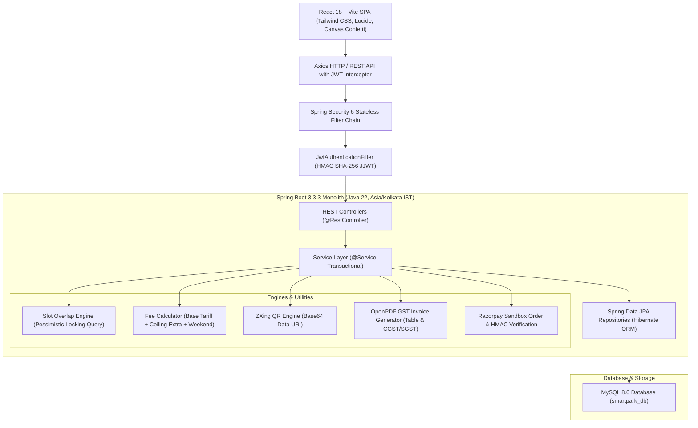

# SmartPark System Architecture 🏛️

## 1. Overview
SmartPark is designed following clean, layered architectural principles for enterprise readiness, maintainability, and high-concurrency reservation processing.

---

## 2. Layer Responsibilities

### 2.1 Presentation Layer (React 18 + Vite)
- **State Management**: React Context (`AuthContext` & `NotificationContext`) for JWT authentication and unread notification alerts.
- **Routing**: `react-router-dom` with `ProtectedRoute` enforcing Role-Based Access Control (`ROLE_CUSTOMER`, `ROLE_PARKING_ADMIN`, `ROLE_SUPER_ADMIN`).
- **Interactive UI**: Floor tabs, visual slot grid with dynamic states (Available, Occupied, Selected, Maintenance, Incompatible), Razorpay checkout modal, QR ticket viewer, and Gate Scanner terminal.

### 2.2 Security Layer (Spring Security 6)
- **Stateless Session**: Disabled HTTP sessions (`SessionCreationPolicy.STATELESS`).
- **JWT Authorization**: Custom `JwtAuthenticationFilter` parses Bearer tokens, validates signatures against secret key, and populates `SecurityContextHolder`.
- **CORS Configuration**: Fully configured for local development and cross-origin frontend consumption.

### 2.3 Business Logic & Service Layer
- **Overlap Prevention**: Double-booking prevention using SQL interval overlap condition:
  $$\text{Overlap} \iff (b.\text{startTime} < \text{requestedEndTime}) \land (b.\text{endTime} > \text{requestedStartTime})$$
- **Fee Calculation Engine**:
  - Base duration (default 2 hrs) charged at `basePrice`.
  - Extra duration: $\lceil\text{Duration} - \text{BaseHours}\rceil \times \text{extraHourPrice}$.
  - Weekend surcharge applies if parking date is Saturday or Sunday.
  - GST Calculation: CGST (9%) + SGST (9%) on net taxable value.
- **QR Code Engine**: Encodes unified JSON metadata containing booking number, slot, vehicle, and validation timestamp as high-resolution Base64 PNG.
- **PDF Invoice Engine**: Generates A4 PDF invoices using OpenPDF with tax breakdown and official company stamps.

### 2.4 Data Access Layer (Spring Data JPA + MySQL 8.0)
- Enforces relational constraints, unique keys, and composite indexes.
- Automatic database schema creation (`ddl-auto: update`) and seeding on boot via `DataInitializer`.
