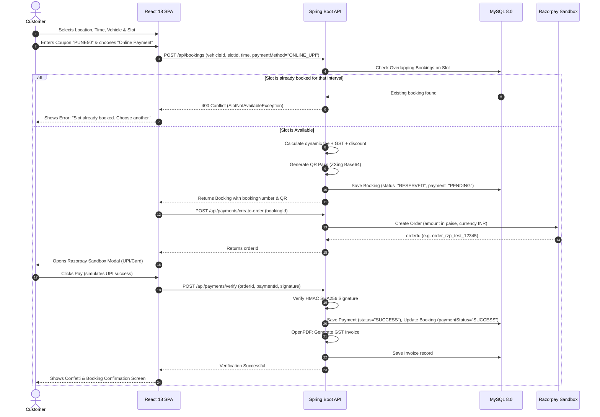
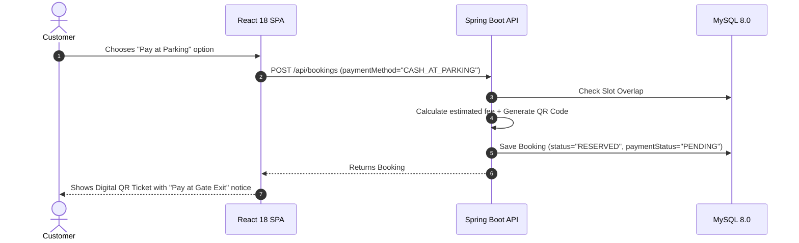
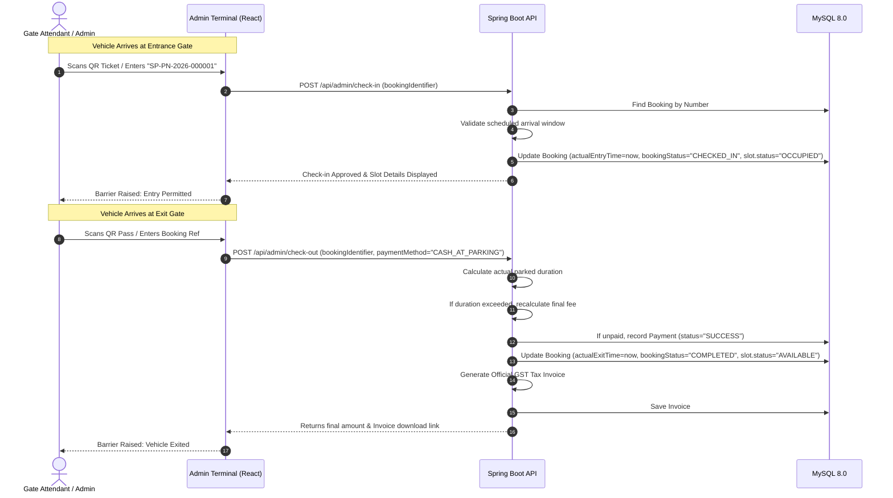

# SmartPark User & Payment Flow Diagrams 🔄

## 1. Customer Online Reservation Flow (Razorpay Sandbox)

---

## 2. Pay at Parking Counter Flow

---

## 3. Gate Attendant Terminal: Check-In & Check-Out Workflow

